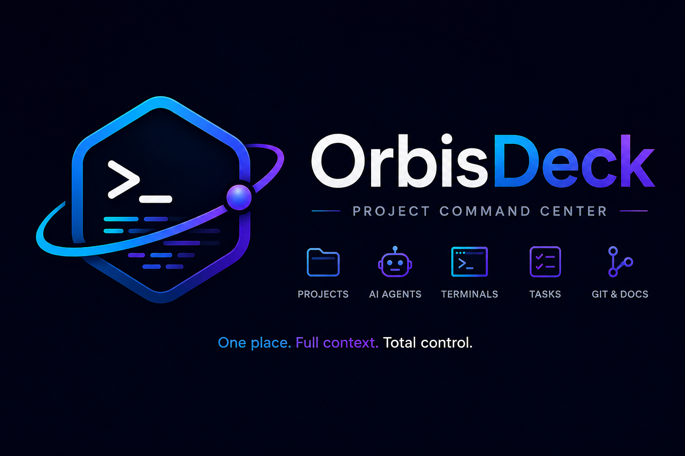

<div align="center">



# OrbisDeck

**Project command center — one place, full context, total control.**

*A macOS desktop shell for running multiple Claude Code projects from a single window.*

</div>

---

## What it is

OrbisDeck is a control center over your projects, terminals, agents, docs, and config — it
**orchestrates existing local tools**, it does not replace them. It is *not* a code editor,
*not* a Git client, *not* an agent system, and *not* an LLM.

> *"GitKraken + Ghostty + Claude Code + Project Dashboard in one window."*

Each project is independent: its own persistent terminal session(s), file watcher, git
context, and settings profile. Project switching is instant — sessions stay alive in the
background.

## Status

**M1 + M2 + M3 + M4 shipped.**

| Milestone | Scope | State |
|-----------|-------|-------|
| **M1 — The Shell** | Electron + React + TS shell, project tabs, JSON state store | ✅ |
| **M2 — Terminals** | Per-project multi-tab persistent terminals (node-pty + xterm), run/test/build spawn | ✅ |
| **M3 — Glanceable context** | Git summary (simple-git), lazy file tree (chokidar) + read-only viewer, Preview/Diff panel | ✅ |
| **M4 — Claude-native** | Read-only `~/.claude` config viewer + per-project CLAUDE.md tab | ✅ |
| **M5 — Beyond the shell** | Resizable/dynamic panels, smarter project settings, richer file viewer, Docker management, CLAUDE.md as managed elements, agents | planned |

See [`ROADMAP.md`](./ROADMAP.md) for the live plan, design direction, and the full M5 scope.
[`IDEA.md`](./IDEA.md) is the product spec.

## Stack

**Electron** (desktop shell) · **React + TypeScript** (UI) · **xterm.js** (terminal render) ·
**node-pty** (PTY / process spawn) · **chokidar** (file watching) · **simple-git** (git).

**Architecture** — strict two-process split. The renderer talks to the main process through a
single typed IPC seam (`src/shared/ipc-contract.ts`, exposed as `window.cockpit`); a lint rule
fails CI if the renderer reaches past it into `electron`/`fs`/`node-pty`. All OS/native concerns
(PTY, watchers, git, `~/.claude` reads) live in `src/main/`.

## Commands

```bash
npm run dev        # electron-vite dev (HMR renderer + main/preload watch)
npm run build      # build all three targets to out/
npm start          # preview the built app
npm run typecheck  # tsc over node + web projects (no emit)
npm run lint       # ESLint — enforces renderer purity
npm run rebuild    # rebuild node-pty against Electron's ABI
npm run pack       # electron-builder package (mac dir target)
```

If terminals won't spawn or Electron won't launch after `npm install`, run
`node scripts/fix-native.mjs` (repairs node-pty's `spawn-helper` exec bit and incomplete
Electron extraction — see [`CLAUDE.md`](./CLAUDE.md) for details).

## License

**GNU General Public License v3.0** © 2026 Alexander Kurach — see [`LICENSE`](./LICENSE).

Copyleft: you may use, study, modify, and redistribute this software, but **any distributed
derivative must remain open under GPLv3** — it cannot be closed-sourced or rolled into a
proprietary product.
